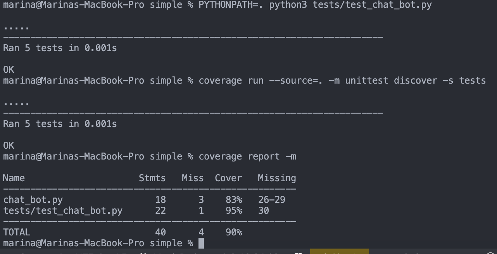

# Chatbot testing repository

Welcome to the Chatbot Testing Repository! This repository contains tools and scripts to test chatbots written in Python. Below are instructions on how to test a simple terminal-based chatbot, a chatbot with a UI.

## Table of Contents

- [Getting Started](#getting-started)
- [Testing a Simple Chatbot](#testing-a-simple-chatbot)
- [Testing a Chatbot with UI](#testing-a-chatbot-with-ui)
- [Contributing](#contributing)
- [License](#license)

## Getting started

Macbook:

To get started, ensure you have Python 3 installed on your machine. You can check your Python version by running:

```bash
python3 --version
```

## Testing a simple Chatbot

To test a simple chatbot that operates in the terminal, follow these steps:

1. Clone the repository to your local machine:

   ```bash
   git clone https://github.com/Tesena-smart-testing/chatbots.git
   ```
2. Run the test script using Python 3 from simmple/tests repository:

   ```bash
   python3 test_chat_bot.py
   ```

This will execute the tests for the terminal-based chatbot.

### IF you it doent work, follow this part:

To run the tests, ensure you are in the `simple` directory and execute the following command:

```
PYTHONPATH=. python3 tests/test_chat_bot.py
```

This command sets the `PYTHONPATH` to the current directory, allowing Python to locate the necessary modules and run the tests successfully.

## Testing a Chatbot with UI

To test a chatbot with a graphical user interface (UI), follow these steps:

1. Ensure you have Flask installed. If not, install it using pip:

   ```bash
   pip install flask
   ```
2. Start the Flask app:

   ```bash
   python3 app.py
   ```
3. Open your web browser and navigate to `http://localhost:5000` to interact with the chatbot UI.


## Measuring Code Coverage

To measure how much of your code is covered by the unit tests:

1. **Install the Coverage Tool**:
   If you haven’t installed it yet, run:
   ```bash
   pip install coverage
   ```

**Run Tests with Coverage** :
Execute the tests and measure coverage with the following command from simple repo:

```
coverage run --source=. -m unittest discover -s test
```

**View the Coverage Report** :
After running the tests, generate a report with:

`coverage report -m`

**Generate an HTML Coverage Report (Optional)** :
For a detailed line-by-line coverage report:

`coverage html`


